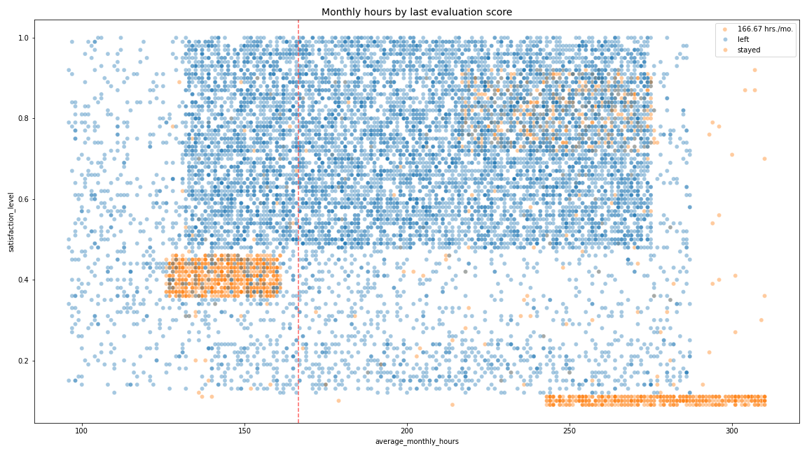
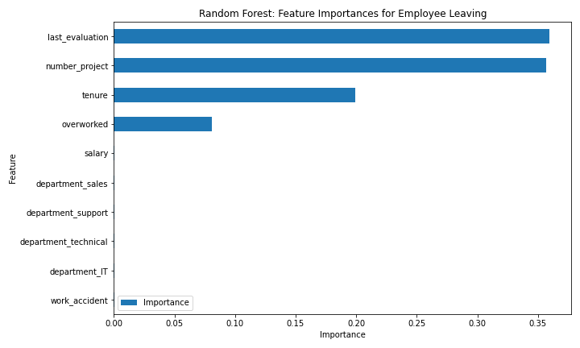

# Employee Attrition Analysis

This project examines employee attrition from an HR analytics perspective: not only predicting who may leave, but also understanding the patterns behind turnover and translating them into practical retention insights. The analysis is based on employee-level HR data and combines data cleaning, exploratory analysis, feature engineering, and predictive modeling.

## Why this project

Employee turnover creates both direct and indirect costs through recruiting effort, onboarding time, productivity loss, and knowledge loss. The goal of this project was to study which employee characteristics are most associated with attrition and to build a model that can support earlier and more targeted HR interventions.

## What this project covers

The workflow includes:

- Data quality checks and structure review
- Exploratory data analysis of attrition patterns
- Comparison of multiple classification models
- Feature refinement to reduce leakage risk
- Interpretation of the final model through feature importance
- Business recommendations based on the analysis

## Dataset

This project uses a public HR employee attrition dataset from Kaggle. The data is structured at the employee level, where each row represents one employee record and the target variable indicates whether the employee left the company.

Key variables used in the analysis include:

- satisfaction level
- last evaluation
- number of projects
- average monthly hours
- time spent at the company
- work accident
- promotion in the last 5 years
- department
- salary
- attrition label

A short data note is included in [`data/README.md`](data/README.md).

## Data quality observations

Before modeling, the dataset was reviewed for basic quality issues. Main observations:

- Around 15,000 employee records
- No missing values
- 3,008 duplicate rows reviewed and removed before analysis
- A
This project was not only about training a classifier. The main value was turning HR data into a structured business case. The analysis suggests that organizations could benefit from:ttrition rate of roughly 16.6%

## Main findings

Two broad attrition patterns stood out in the analysis.

- **Overwork**: a group of employees who left showed extremely high monthly working hours, suggesting sustained overload.
- **Low satisfaction / under-engagement**: another group left despite working closer to normal monthly hours, but with clearly lower satisfaction levels.

Other notable findings included:

- High project load was strongly associated with attrition risk.
- Employees assigned to 7 projects all left the company.
- Tenure and evaluation history also contributed strongly to prediction performance.

## Modeling approach

I compared several classification approaches:

- Logistic Regression as a baseline
- Decision Tree for interpretable rule-based modeling
- Random Forest for stronger nonlinear pattern capture and generalization

The baseline model provided a useful starting point, but tree-based methods performed better, especially in identifying employees who actually left. As part of the refinement step, I also introduced an **overworked** indicator based on monthly working hours.

## Final model performance

After feature refinement, the strongest final model was a **Random Forest**. Final test performance:

- **Accuracy:** 96.1%
- **Precision:** 87.4%
- **Recall:** 90.3%
- **F1-score:** 88.6%
- **ROC-AUC:** 93.8%

These results indicate that the final model was clearly stronger than the logistic regression baseline, particularly for identifying employees at risk of attrition.

## Selected visuals

### Workload, Satisfaction, and Attrition

The figure above highlights the two main attrition patterns in the dataset: one related to sustained overload, and another linked to low satisfaction.

### Feature Importance from the Final Model

The final Random Forest model placed the strongest importance on evaluation history, project load, tenure, and the engineered overwork indicator.

## Business value
This project was not only about training a classifier. Its main value lies in turning HR data into a structured business case and translating analytical findings into practical retention actions. The analysis suggests that organizations could benefit from:

- Monitoring employees with sustained high workloads
- Re-balancing project assignments where overload patterns appear
- Identifying low-satisfaction employees earlier for intervention
- Reviewing career progression signals for longer-tenured employees
- Using attrition-risk predictions to prioritize HR follow-up
